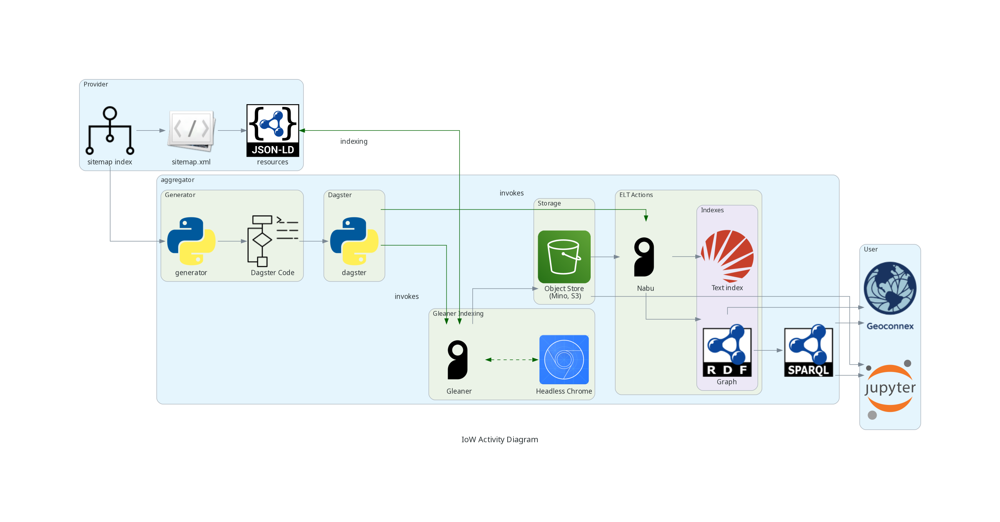

# harvest.geoconnex.us

This repository holds the infrastructure as code scripts for the deployment of the Geoconnex knowledge graph. For general info on Geoconnex and a more detailed description of the tech stack, see [docs.geoconnex.us](https://docs.geoconnex.us/)

## Components

The full Geoconnex tech stack is composed of 

1. [gleaner](https://github.com/internetofwater/gleaner), a golang cli program which harvests JSON-LD documents from remote sitemaps and puts them in S3
2. [nabu](https://github.com/internetofwater/nabu), a golang cli program which synchronizes an S3 bucket with a graph database
3. [scheduler](https://github.com/internetofwater/scheduler), a full stack data platform which uses Python and [dagster](https://dagster.io/) to run gleaner and nabu on a schedule for each source in the Geoconnex sitemap. 
4. An S3 bucket for storing jsonld data
5. A graph database like graphdb for sparql queries

