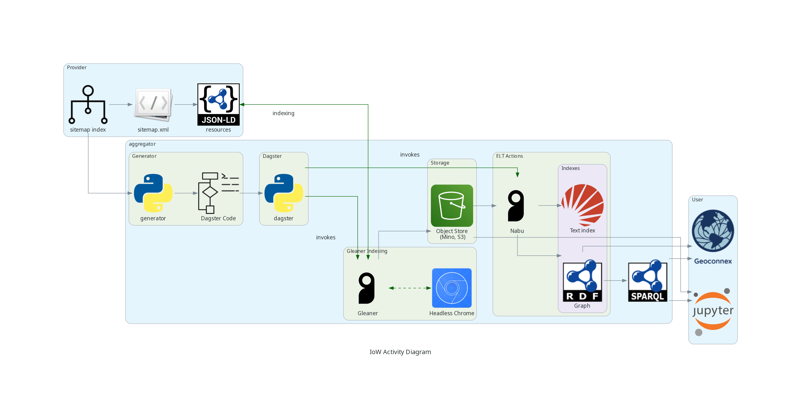

# IoW Activity Flow

## Overview

### Draft Workflow

#### Architecture section
* Deploy Docker Compose based architecture

#### Worflow section
* Use _cfgBuilder.py_ to build the main IoW configuration file for indexing
* Use _Dagster Generator script_ to build the Dagster code base
* Build and push the containers for Dagster

#### Load the graphs
* Load the harvested resources into the graph and text index (manual or via above workflow)

### Query
* Query via SPARQL, web UI or Notebooks 

